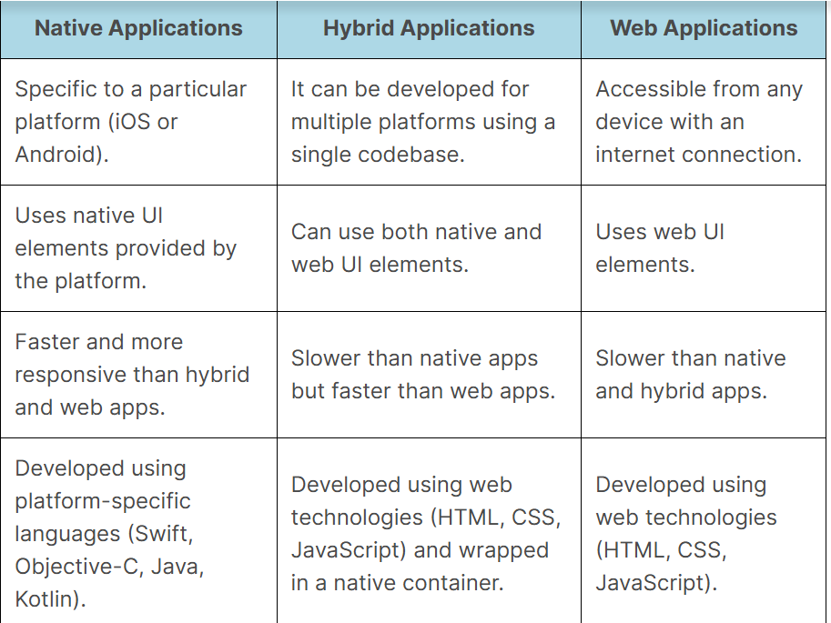

## Appium Interview Questions

### 1. Desired Capabilities ?
Desired Capabilities are keys and values encoded in a JSON, sent by Appium clients to the server when a new automation session is requested.
They tell the Appium drivers all kinds of important things about how you want your test to work.

Some common desired capabilities used in Appium include:

1. platformName: The name of the device's operating system, such as Android or iOS.
2. deviceName: The name of the mobile device on which the application is to be tested.
3. appPackage: The application's package name that needs to be tested.
4. appActivity: The name of the activity to be launched for the application.
5. automationName: The name of the automation tool to be used for testing, such as Appium or Selendroid.
6. udid: The unique device identifier of the mobile device.


### 2. Appium Architecture?

1. Appium Client libraries converts the user written commands to the REST API requests.
2. These requests are sent to the Appium Server using Mobile JSON Wire Protocol.
3. Appium server forward these requests to target android device/emulator.
4. Device/emulator then reverts the outcome of the performed command to the Appium server via bootstrap.jar.
5. Appium server forwards this response to the client.

### 3. How does Appium works?
At the core, Appium is an HTTP server written in nodejs that exposes REST API.
The client communicates with Appium server via REST API’s and it is handled by Mobile JSON Wire Protocol.

The first step in this communication flow is the creation of the session. The client initiates the session by sending a request to the server consisting of session related information in key-value pairs, called as Desired Capabilities. 
On the basis of Desired Capabilities, Appium can differentiate between iOS and android platform and launch a session on target device/simulator/emulator. A session initiation is basically a POST /wd/hub/session request by client. Appium responds to this request in the form of a session id.

```java
new ServerManager().startServer();
new DriverManager().initializeDriver();
AppiumDriver driver = new AndroidDriver(new ServerManager().getServer().getUrl(), new CapabilitiesManager().getCaps());

```

### 4. Native, Hybrid and Web Applications?



### 5. What is the role of appium server in automation testing?
In automation testing, the Appium server plays a crucial role as it acts as a mediator between the mobile device and the automation script. 
The Appium server is responsible for receiving the commands from the automation script and translating them into actions on the mobile device.

### 6. What is Appium Session?
Communication channel between the client and the Appium server.
The session is started once the client requests to start a session with the Appium server and receives a session ID in return.

The client asks the Appium server to perform various tasks during the session, including opening the application, interacting with UI elements, taking screenshots, and other operations.
